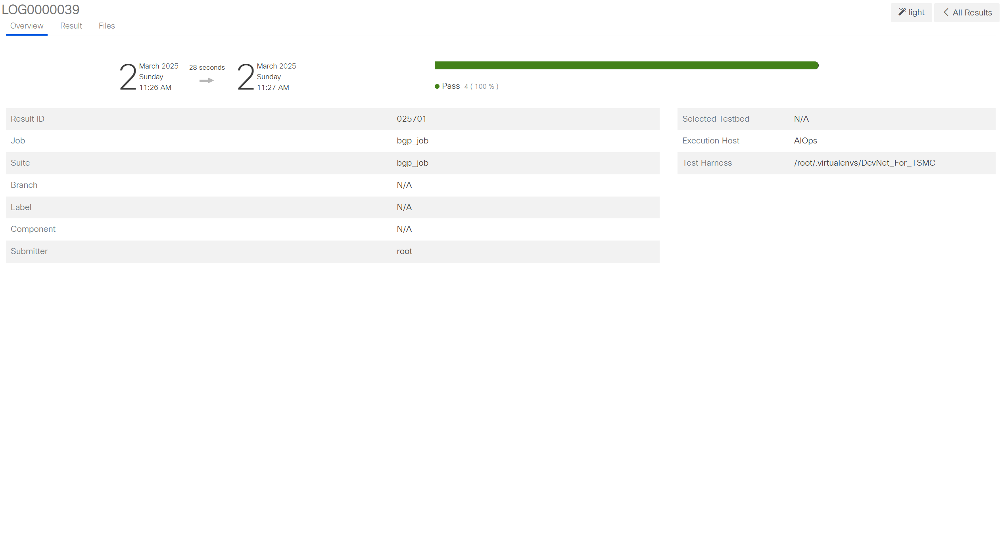
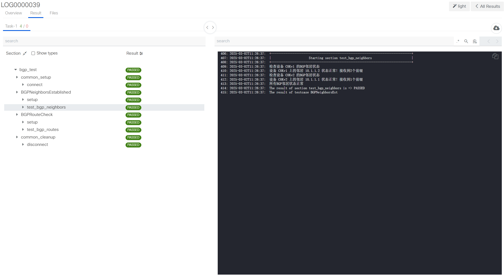

### 执行job
```shell
(DevNet_For_TSMC) [root@AIOps pyats_5_job]# pwd
/DevNet_For_TSMC/part_3_pyats/pyats_5_job

(DevNet_For_TSMC) [root@AIOps pyats_5_job]# pyats run job bgp_job.py --no-mail

```

### 查看日志
```shell
(DevNet_For_TSMC) [root@AIOps pyats_5_job]# pyats logs view --host 0.0.0.0 --port 8080 -v

```

### WEB查看

